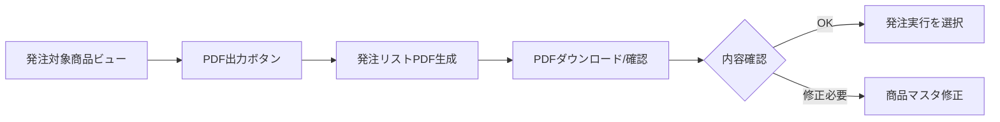

# 発注ワークフロー

## 業務フロー

### 1. PDF出力と確認


### 2. 発注実行の流れ

#### Step 1: PDF出力（必須）
1. 「発注対象商品」ビューを開く
2. **「発注リストPDF」ボタン**をタップ
3. PDFが生成されダウンロード可能に
4. 内容を確認

#### Step 2: 発注記録作成（オプション）
PDFを確認後、以下の方法で発注実行：

**方法A: ボットから実行**
```yaml
Bot Name: PDF出力後_発注確認
Event:
  Type: File created
  Folder: /発注リスト/
Process:
  - Send notification with confirmation link
  - Link to action: PDF確認後_発注実行
```

**方法B: 手動で実行**
1. PDFを確認後、管理者が判断
2. 「Automation」→「Run action」から「PDF確認後_発注実行」を実行
3. 発注記録が一括作成される

## 3. 実装のポイント

### PDF生成ボット設定
```yaml
Bot Name: 発注リストPDF生成
Event:
  Type: Action triggered
  Action: 発注リストPDF出力
Task:
  Type: Create file
  File Type: PDF
  Template: 発注リスト_Template.docx
  Save to: /発注リスト/
  Filename: CONCATENATE("発注リスト_", TEXT(NOW(), "YYYY-MM-DD_HHmm"), ".pdf")
  Table: 商品マスタ
  Filter: [発注対象フラグ] = TRUE
```

### PDFテンプレートの要点
- 発注対象商品を一覧表示
- 商品ごとの推奨発注数を明記
- 合計金額を表示
- 承認欄を設ける（印刷用）

### 独立実行のメリット
1. **確認プロセス**: PDFで内容確認してから発注
2. **承認フロー**: 上司の承認後に発注実行可能
3. **修正機会**: PDF確認後、必要なら修正してから発注
4. **監査証跡**: PDFが発注前の記録として残る

## 4. カスタマイズオプション

### A. 承認フロー追加
```yaml
追加テーブル: 発注承認
カラム:
  - 承認ID
  - PDF名
  - 承認者
  - 承認日時
  - ステータス（承認待ち/承認済み/却下）
```

### B. 自動実行条件
```yaml
条件付き自動実行:
  - 合計金額 < 100,000円: 自動発注
  - 合計金額 >= 100,000円: 承認必要
```

### C. 通知設定
```yaml
Email通知:
  - PDF生成完了時
  - 承認待ち時
  - 発注実行完了時
```

## 5. トラブルシューティング

### PDF生成されない場合
- 発注対象商品が0件でないか確認
- テンプレートファイルの存在確認
- Google Drive連携の確認

### 発注記録が作成されない場合
- 発注対象フラグの確認
- アクションの条件式確認
- ユーザー権限の確認